# Rewind

**Your personal video archive.** Save videos from YouTube, Vimeo, and [hundreds of other sites](https://github.com/yt-dlp/yt-dlp/blob/master/supportedsites.md) to your own server. Search transcripts, create clips, and never worry about a video disappearing from the internet again.

Rewind runs entirely on your hardware. No cloud accounts, no subscriptions, no data leaving your network.

## Screenshots

### Home

Paste a URL to start archiving. Recent downloads appear below for quick access.

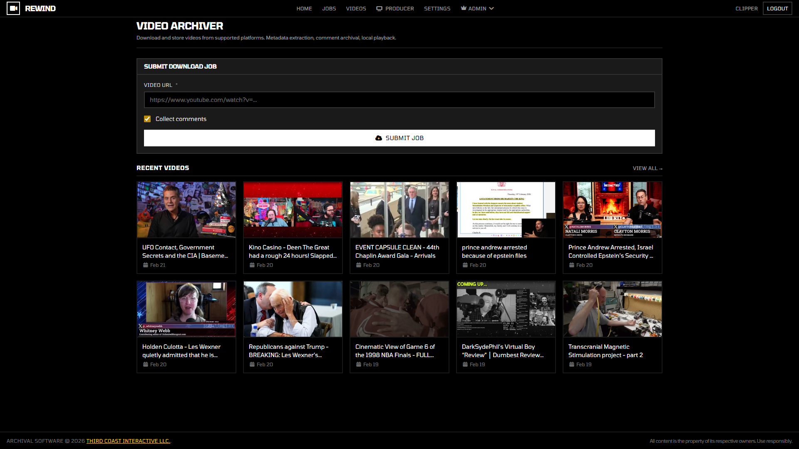

### Library

Browse your archive with search, filters, and sorting. Thumbnails and metadata make it easy to find what you're looking for.

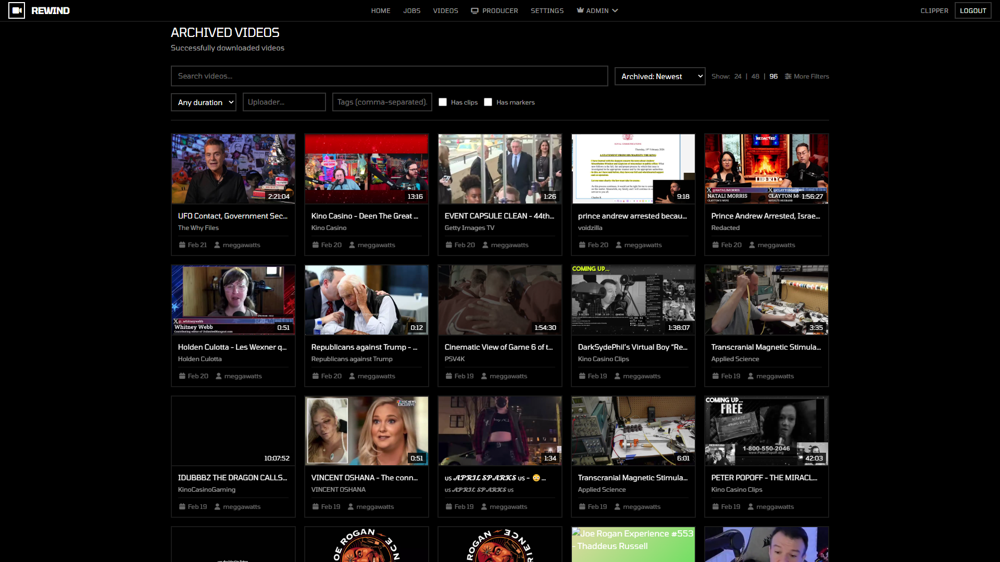

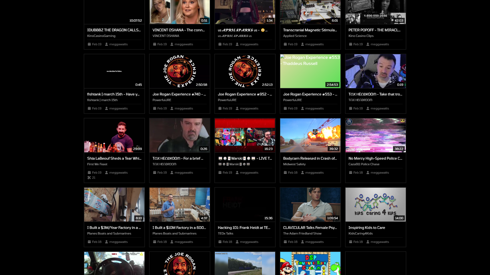

### Video Detail

Watch videos with a synced, searchable transcript. Click any line to jump to that moment. Search the transcript to find specific dialogue and create clips from the results.

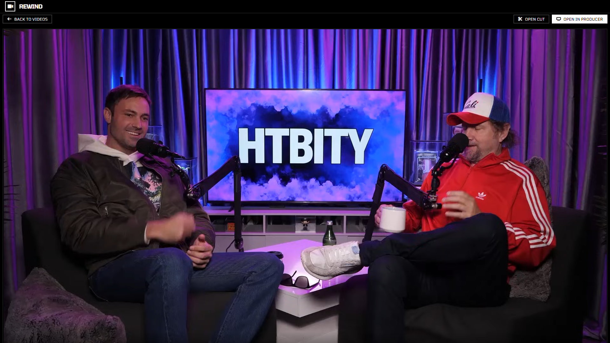

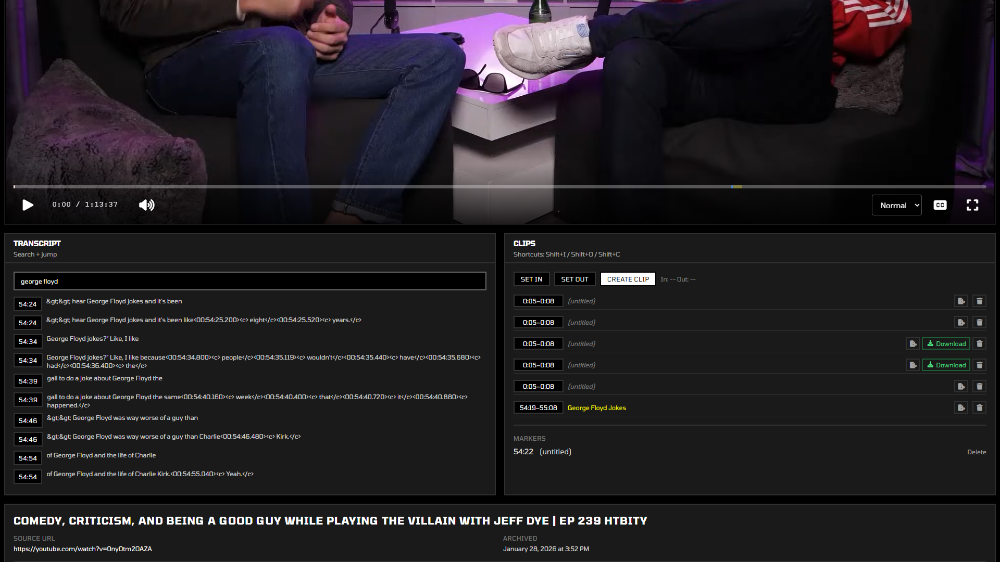

### Clip Editor

Trim segments for export using a zoomable timeline with precise in/out markers. Subtitles align with the timeline to help you find the exact cut point.

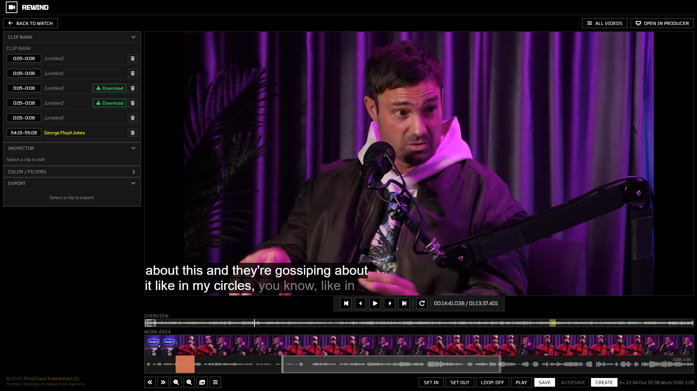

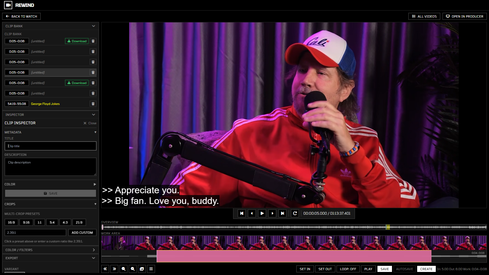

Stack color and spatial filters on your clips before export. Choose format, quality, and crop variant from the sidebar.

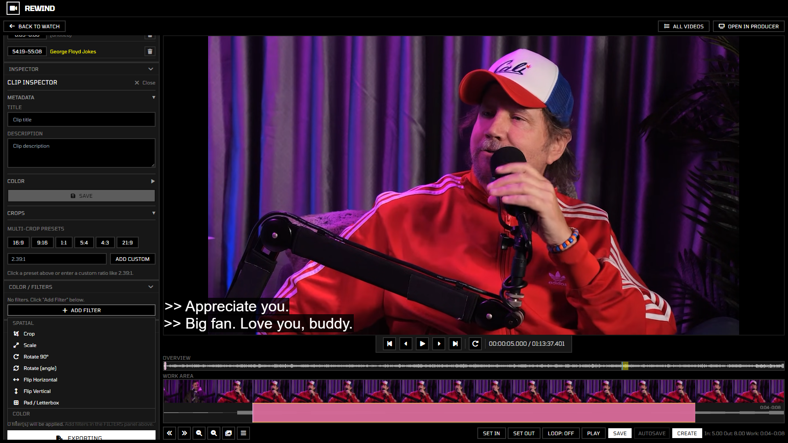

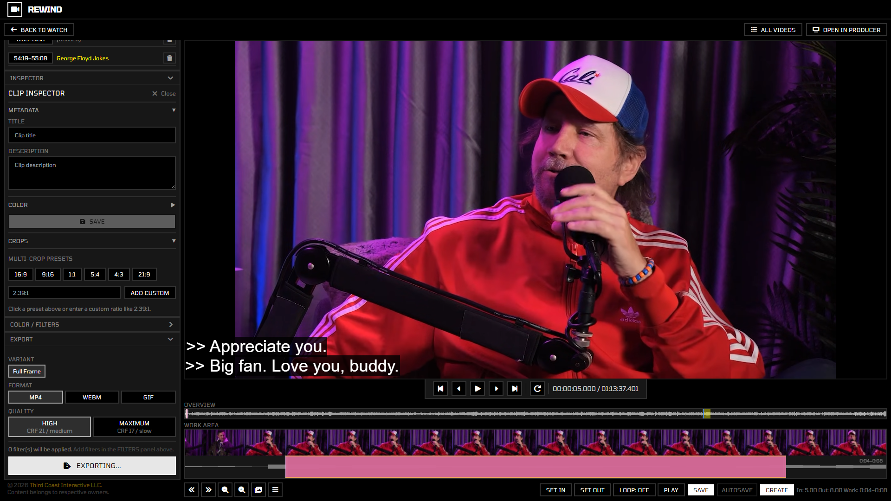

### Settings & Keybindings

Configure cookies for age-restricted downloads, interface preferences, and rebind every keyboard shortcut.

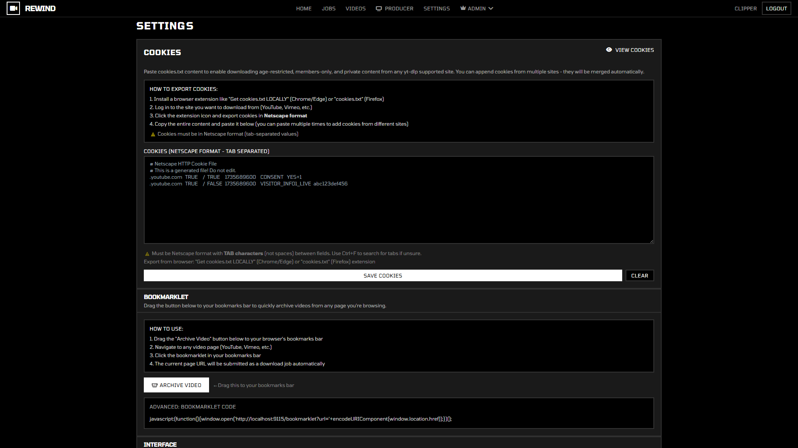

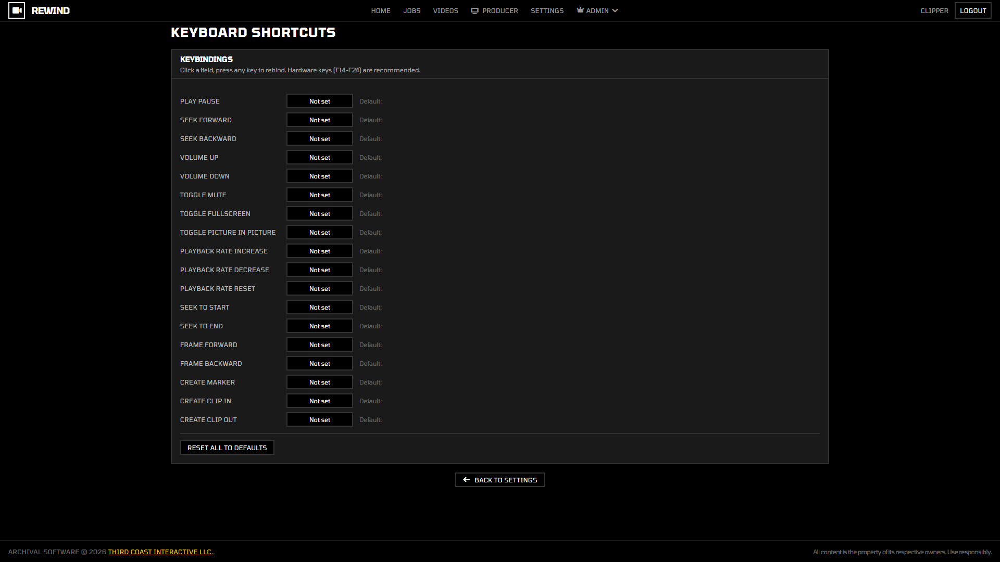

### Admin Dashboard

View storage metrics, video-per-day charts, and manage exports and users.

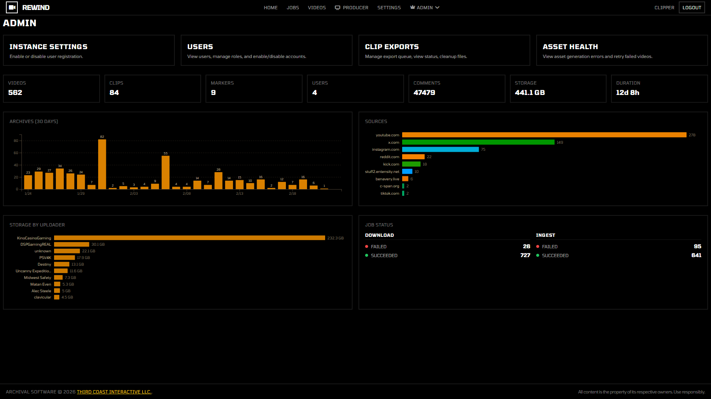

### Remote Playback (Producer)

Control video playback on a remote device. Useful for OBS scenes and live streaming setups. Includes a scene layout editor with background effects, aspect ratio presets, and live telemetry.

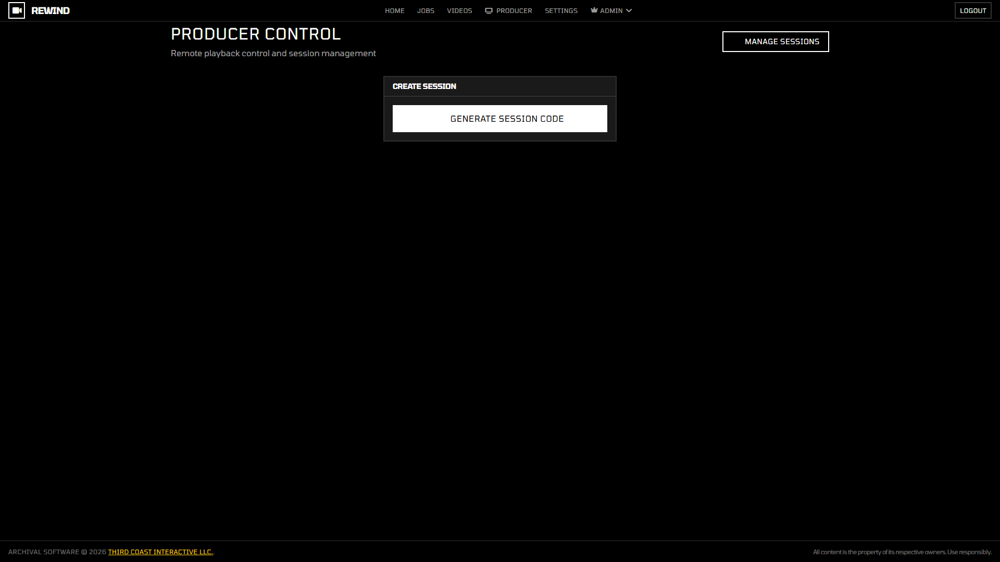

### Download Jobs

Monitor download progress, retries, and errors from a single dashboard.

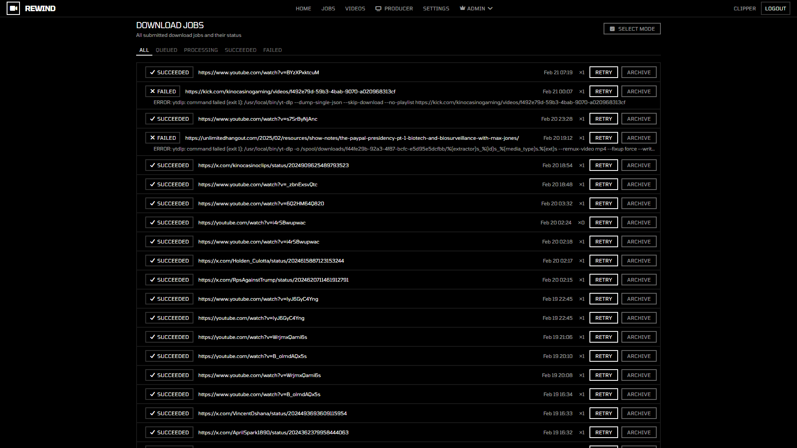

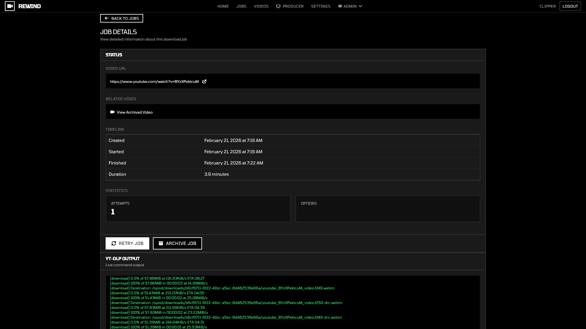

## Features

- **Video archival** - download from YouTube, Vimeo, and [hundreds of other sites](https://github.com/yt-dlp/yt-dlp/blob/master/supportedsites.md) via [yt-dlp](https://github.com/yt-dlp/yt-dlp)
- **Automatic transcription** - [OpenAI Whisper](https://github.com/openai/whisper) generates searchable captions for every video
- **Transcript search** - find any word across all your videos and jump directly to that moment
- **Clip editor** - mark in/out points on a zoomable timeline, align with subtitles, and export video segments
- **Color filters** - stack FFmpeg filters (brightness, contrast, blur, color balance, and more) with live preview before export
- **Crop presets** - create crop regions for different aspect ratios (16:9, 9:16, 1:1, etc.) and export multiple variants per clip
- **SponsorBlock** - auto-skip sponsor segments on YouTube videos with on-screen notifications
- **Markers & comments** - add timestamped markers with colors, and view imported YouTube comments
- **Remote playback** - control video playback on another device with a scene layout editor (great for OBS and streaming)
- **Admin dashboard** - storage metrics, video-per-day charts, user management, and export queue monitoring
- **Customizable keybindings** - rebind every keyboard shortcut, including hardware keys (F14-F24)
- **Browser extension** - right-click any video on YouTube to queue it for download
- **Fully self-hosted** - runs on Docker, stores everything locally, no external services required

## Quick Start

### Requirements

- [Docker Desktop](https://www.docker.com/products/docker-desktop/) (includes Docker Compose)
- Enough disk space for your video library

### 1. Clone and configure

```bash
git clone https://github.com/ThirdCoastInteractive/Rewind.git
cd Rewind
cp .env.example .env
```

Open `.env` in a text editor and fill in these values:

| Variable            | Description                                                        |
| ------------------- | ------------------------------------------------------------------ |
| `POSTGRES_PASSWORD` | Pick any password for the database                                 |
| `SESSION_SECRET`    | A random string for signing session cookies                        |
| `ENCRYPTION_KEY`    | 32-byte hex key. Generate one with `openssl rand -hex 32`          |

### 2. Start

```bash
make up
```

Or without `make`:

```bash
docker compose up -d
```

### 3. Open

Visit **http://localhost:8080** in your browser.

Change the port with `WEBSERVER_PORT` in `.env` if needed.

### 4. View logs

```bash
make logs
```

### 5. Stop

```bash
make down
```

## Configuration

All settings live in your `.env` file. See [.env.example](.env.example) for the full list with descriptions.

### Transcription (Whisper)

Rewind automatically transcribes every video using [OpenAI Whisper](https://github.com/openai/whisper), making your entire library searchable by spoken word.

| Variable           | Default | Description                                                              |
| ------------------ | ------- | ------------------------------------------------------------------------ |
| `WHISPER_ENABLED`  | `true`  | Set to `false` to skip transcription                                     |
| `WHISPER_MODEL`    | `small` | Model size: `tiny`, `base`, `small`, `medium`, `large`, `large-v2`, etc  |
| `WHISPER_DEVICE`   | `cpu`   | Set to `cuda` for NVIDIA GPU acceleration                                |
| `WHISPER_LANGUAGE` | `en`    | Language code (e.g. `en`, `es`, `ja`)                                    |

Larger models are more accurate but use more memory and take longer to process. The `small` model is a good default for most systems.

### GPU Acceleration (Optional)

If you have an NVIDIA GPU, you can speed up transcription significantly:

1. Set `WHISPER_DEVICE=cuda` in `.env`
2. Install the [NVIDIA Container Toolkit](https://docs.nvidia.com/datacenter/cloud-native/container-toolkit/install-guide.html)
3. Uncomment the GPU section in the `ingest` service in `docker-compose.yml`:

```yaml
    deploy:
      resources:
        reservations:
          devices:
            - capabilities: [gpu]
```

Restart the stack after making changes.

### Storage

By default, Rewind stores files in subdirectories of the project folder:

| Path                      | Contents                          |
| ------------------------- | --------------------------------- |
| `./bin/spool`             | Temporary workspace for downloads |
| `./bin/download`          | Archived video files              |
| `./bin/exports`           | Exported clips                    |
| `./bin/dev/postgres/data` | Database data                     |

You can change these paths in `docker-compose.yml`. For large libraries, point them at a drive with plenty of space.

## Deployment

- **Home / local network** - run `docker compose up -d` and access via `http://localhost:8080`
- **Expose to the internet** - put Rewind behind a reverse proxy with HTTPS. Good options: [Cloudflare Tunnel](https://developers.cloudflare.com/cloudflare-one/connections/connect-networks/), [Caddy](https://caddyserver.com/), [Nginx](https://nginx.org/), or [Traefik](https://traefik.io/)
- **Backups** - regularly back up your PostgreSQL database and video files

## Browser Extension

Save videos to Rewind with one click from your browser.

**Chrome / Chromium:**

1. Open `chrome://extensions`
2. Enable **Developer mode** (top-right toggle)
3. Click **Load unpacked** and select the `extensions/chrome-extension-v3/` folder

**Firefox:**

Load the extension from `extensions/firefox-extension/`.

## How It Works

Rewind is built as a set of small services that run together via Docker Compose:

| Service       | What it does                                     |
| ------------- | ------------------------------------------------ |
| `web`         | Serves the UI and API                            |
| `downloader`  | Fetches videos using yt-dlp                      |
| `ingest`      | Generates thumbnails and runs transcription      |
| `encoder`     | Exports clips to video files                     |
| `postgres`    | Stores all metadata, transcripts, and job state  |
| `pg-migrator` | Applies database schema updates on startup       |

The downloader and ingest services run multiple copies in parallel by default so several videos can be processed at once. You can adjust the replica counts in `docker-compose.yml` to match your hardware.

## Roadmap

Planned features and improvements (no particular order):

- [ ] **Producer v2** - Self-hosted live production suite (Streamyard alternative). WebRTC via Pion SFU, Three.js scene compositor, multi-host webcam/mic, Show Notes with nested content blocks, OBS browser source output
- [ ] **Three.js shader library** - Extensible effect system for producer scenes (backgrounds, particles, 3D objects), deterministic sync for remote playback
- [ ] Playlist and channel archival (batch download entire channels/playlists)
- [ ] Scheduled/recurring downloads (auto-archive new uploads from channels)
- [ ] Collections and tagging (user-managed tags, browsing, filtering)
- [ ] Unified jobs UI (ingest + download jobs, pagination, job-to-video linking)
- [ ] Bulk operations (batch tag, delete, export)
- [ ] Theme customization (light mode, custom accent colors)
- [ ] Comment ingest (comments are currently archived, but never processed or displayed)

## Contributing

Contributions are welcome! The project uses Go, PostgreSQL, [templ](https://templ.guide/) for HTML templates, and [sqlc](https://sqlc.dev/) for type-safe SQL.

```bash
# Install tools
go install github.com/sqlc-dev/sqlc/cmd/sqlc@latest
go install github.com/a-h/templ/cmd/templ@latest
pnpm install

# Regenerate after changes to .templ or .sql files
make generate

# Run tests
make test
```

## License

[MIT](LICENSE)
