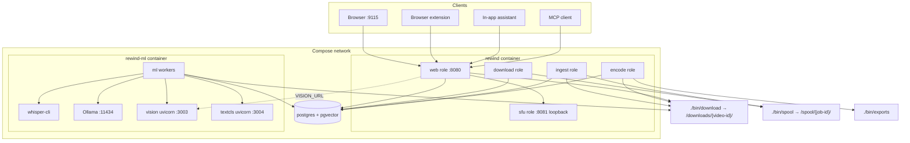
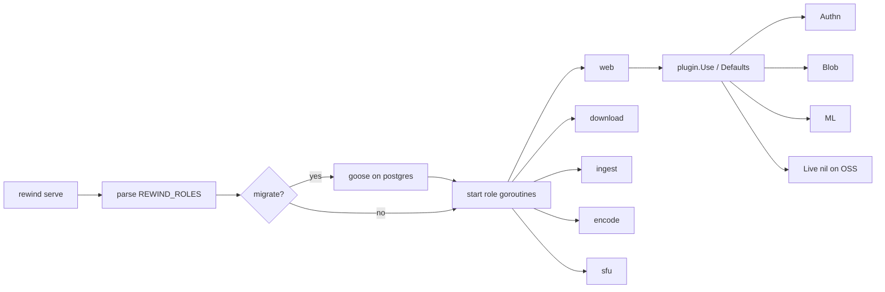
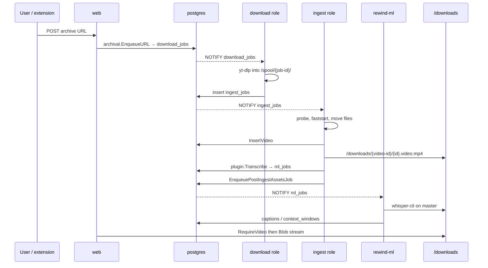
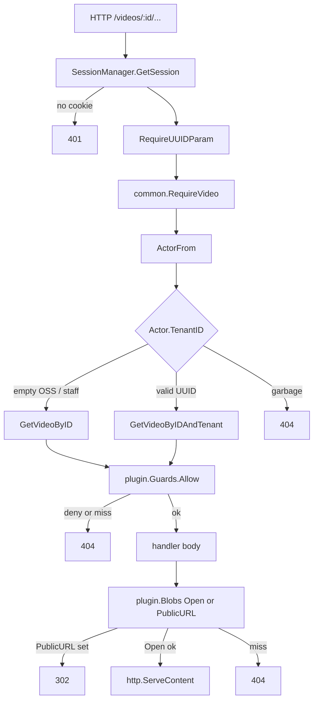
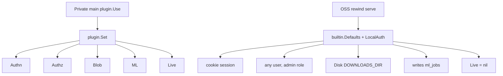
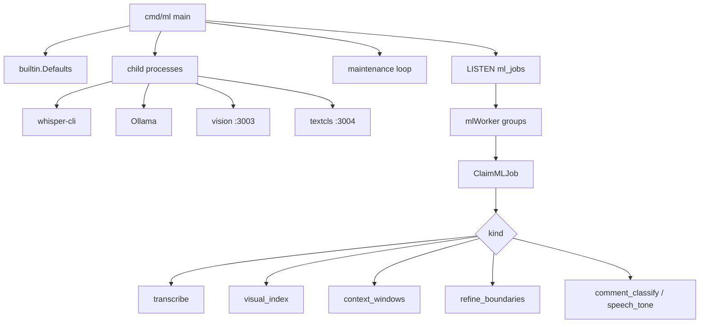
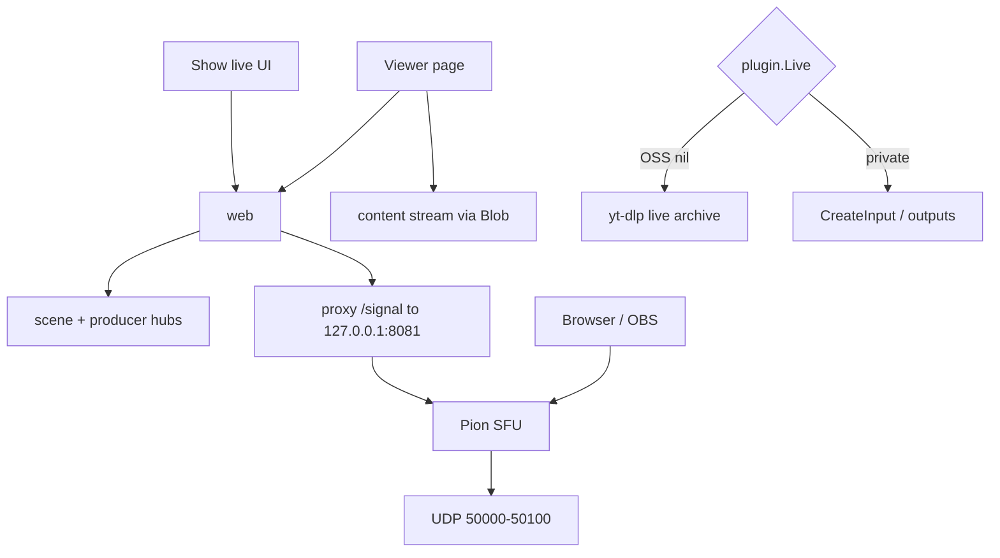
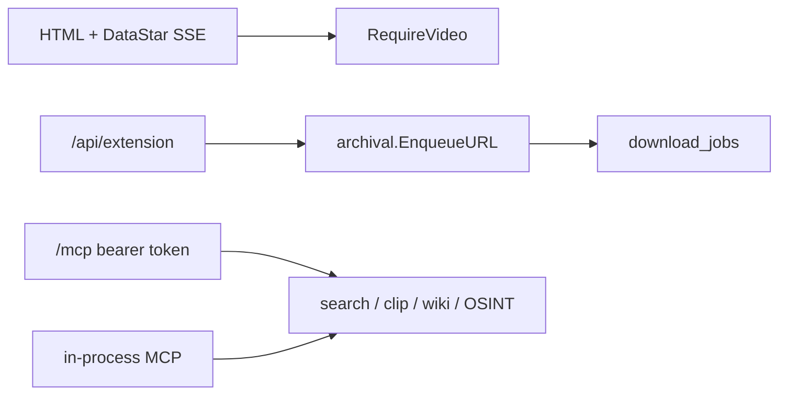

# Architecture

Rewind is a self-hosted video archive. Three Compose services share Postgres and a downloads volume. The `rewind` binary runs several roles in one process. `rewind-ml` is the only process that runs Whisper, Ollama, and vision.

Worker counts (`downloads.workers`, `processing.ingest_workers`, `processing.encoder_workers`, `ml.concurrent`) are live admin settings, not Compose replicas.

## System as a whole



Postgres is the queue: `download_jobs`, `ingest_jobs`, `ml_jobs`, `clip_exports`, `stitch_jobs`. LISTEN/NOTIFY wakes workers. Disk is not a message bus.

## Rewind process — roles in one binary

`pkg/rewindapp.Run` reads `REWIND_ROLES` (default `web,download,ingest,encode,sfu,migrate`). Each role is a goroutine in the same process.



Compose does not run the leftover `cmd/downloader`, `cmd/ingest`, `cmd/encoder`, or `cmd/sfu` binaries.

## Archive pipeline



Download also runs side loops: comment catchup, metadata refresh, channel watches, catalog crawl, subtitle backfill.

Self-hosted ingest stamps `tenant_id` as the OSS UUID. Private live import (`pkg/archive.ImportMaster`) can stamp a real tenant.

## HTTP video access

Every `/videos/:id` HTTP route loads the actor once (`ActorFrom`), then `RequireVideo`. Lists call `WithActorTenant`.



Show-note program stream (`/api/show-notes/:id/content/:videoId`) is the exception: unauthenticated, gated by a live note that references the video. Bytes still come from Blob.

OSS delete requires admin or `ArchivedBy` match. `LocalAuthz` allows any logged-in user for `video.write`, so ownership stays in the handler.

Workers and MCP still use unscoped `GetVideoByID`. They are not HTTP actors.

## Plugin slots

Public Rewind fills Authn (cookie), Authz, Disk blob, and LocalML. Live is unset. A private binary calls `plugin.Use` before `rewindapp.Run`.



Blob keys are `{videoID}/{filename}` on OSS. `plugin.Enqueue` is the only ML enqueue door. The ML image does not copy `cmd/web`.

## rewind-ml process



On CUDA/ROCm, GPU kinds share one worker so Whisper and the large context model do not fight the same card. CPU keeps separate groups. Ingest never runs Whisper; it only enqueues `transcribe`.

## Encode / stitch

```mermaid
flowchart LR
  UI[Cut / stitch editor] --> PG[(clip_exports / stitch_jobs)]
  PG -->|NOTIFY clip_exports| EW[encoderWorker]
  PG -->|NOTIFY stitch_jobs| SW[stitchWorker]
  EW --> FF[ffmpeg]
  SW --> FF
  FF --> Out[/exports]
  EW --> Disk[(/downloads)]
  SW --> Disk
```

## Live / SFU / show notes



## Other doors



MCP lists are not tenant-filtered. The MCP desk is the local archive.
