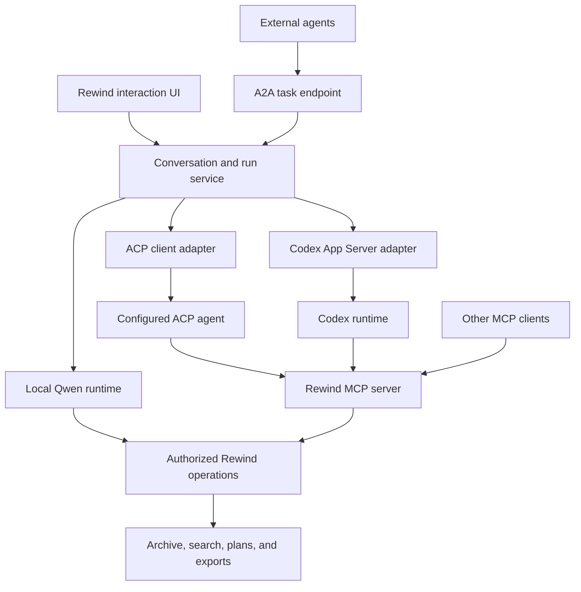

# Agent interfaces and runtimes

Status: proposed; implementation should be coordinated with the local assistant work.
Date: 2026-09-05

Selected first ACP provider: **Grok**, requested by the user. The installed CLI reports `grok 1.0.13 (5e9a58528b76) [stable]`. Its documented entry point is `grok --no-auto-update agent stdio`; authentication supports an existing local login or `XAI_API_KEY`. This records the selected provider and observed executable version, not completion of integration testing. See [Grok ACP documentation](https://docs.x.ai/build/cli/headless-scripting#acp).

## Goal

Let users interact with Rewind through its bundled small Qwen assistant, an external interactive agent, or a delegated agent task. Preserve the existing MCP interface for direct archive operations. Users should see conversations, progress, questions, and resulting Rewind projects in a consistent UI regardless of the selected runtime.

These are distinct roles: Qwen is a model used by a local agent runtime; MCP exposes tools; ACP connects interactive clients and agents; Codex App Server embeds Codex; A2A exchanges tasks between independent agents.

## Integration boundaries

| Integration | Rewind's role | Initial scope |
| --- | --- | --- |
| Local Qwen sidecar | Own the tool loop and model connection | Default local assistant with bounded context and tool use |
| MCP | Serve archive tools to agents | Preserve `/mcp`, bearer authentication, and current tools |
| ACP (Agent Client Protocol) | Act as a client to a configured agent process | Send prompts, receive updates, answer permission requests, supply Rewind MCP configuration |
| Codex App Server | Act as a client to Codex | Map Rewind conversations to Codex threads and runs to turns; stream events and handle approvals |
| A2A | Serve delegated Rewind tasks; later delegate outward | Accept a bounded archive task and return progress and references to resulting artifacts |

ACP server support, exposing Rewind's own assistant to ACP clients, is a later extension. It is separate from the initial ACP client. A2A inbound and outbound support should likewise be delivered separately.

## Shared runtime contract

Start with a small runtime adapter boundary: start a run, stream events, cancel, and answer a pending input or approval request. Resume/reconnect support must be declared by each adapter. Avoid pretending every backend implements the same features.

The local runtime owns its model/tool loop. ACP and Codex adapters let their respective agents own that loop; Rewind forwards requests and consumes events. Rewind operations continue to enforce authorization at execution time.

Persist these concepts across runtimes:

- Conversation and run ownership; chosen runtime and model/configuration snapshot.
- Provider session/thread/turn identifiers, kept separate from Rewind IDs.
- Ordered events with stable cursors for browser reconnects.
- User-visible messages, progress, tool activity, pending questions/approvals, artifacts, and terminal outcomes.
- Cancellation intent and the backend's acknowledgement of cancellation.
- Parent/delegation references when A2A outbound support is added.

Define explicit state mappings per adapter. Suggested internal states are queued, running, waiting for input, waiting for approval, waiting for capacity, completed, failed, cancelled, and interrupted. A disconnect must not automatically mean failure or trigger a second execution. Unsupported resume should produce an interrupted run that can be deliberately restarted.

Normalize the events the UI needs while retaining bounded provider-specific metadata. Do not expose hidden reasoning. Report supported capabilities, including images, tool calling, approvals, cancellation, and resume, before enabling the relevant controls.

## Fit with the local assistant implementation

The working tree currently contains a proposed `00064_agent_settings.sql` migration with `agent_conversations`, `agent_runs`, `agent_events`, and `agent_tool_calls`, plus runtime settings and model-operation tables. This is work in progress, not a deployed schema guarantee.

Build on those records after the local implementation settles. Do not create a second conversation database. Review additions for runtime identity, external IDs, pending requests, artifact references, and state transitions with the implementer before choosing migration numbers.

The existing one-active-run index must be reconsidered if new waiting states are introduced. Worker claims must be runtime-aware so a local-model worker cannot accidentally claim a Codex or ACP run. Provider credentials belong in protected credential storage, not messages, events, or settings snapshots.

Keep model installation and local inference capacity management specific to the local runtime. An external agent connection should not require a Qwen model to be installed.

## Tools, permissions, and reliable execution

Use the existing Rewind operations and MCP tool definitions as the starting point. Extract shared operation logic incrementally where the local runtime needs it; avoid building a second implementation of search, clipping, or export. HTTP and CLI adapters can later reuse the same operations.

Every operation must retain the initiating user's identity, ownership checks, and allowed scope. External agents receive scoped Rewind access rather than an administrator's shared token. Provider approval requests must be surfaced to the correct user and correlated to the correct run; reconnecting must not silently approve them.

For the small Qwen runtime, provide a limited tool set appropriate to the task, compact results, pagination, schema validation, and bounded tool-call/time budgets. Validate actual model behavior before enabling a workflow; do not infer reliability from model size or a nominal tool-calling feature.

Record operation identity before side effects and reconcile uncertain results before retrying. A tool-call log alone does not guarantee exactly-once execution. Reuse existing plan revisions and idempotent project creation. Test uncertain export/download submissions explicitly. Cancelling an assistant run must distinguish between stopping the agent and cancelling already-submitted application jobs.

Agent runtimes must not have unrestricted access to the archive volume or database. Video content and video records must never be deleted by these integrations. Apply the same restrictions to Codex/ACP execution environments, not just MCP tools.

## Delivery sequence and acceptance

1. **Local assistant and MCP foundation.** Complete the small Qwen sidecar. Establish runtime identity and durable run/events without blocking its initial release. Demonstrate search, evidence inspection, and creation of an editable stitch project; verify reconnect, cancellation, ownership, and uncertain tool-result recovery.
2. **Codex App Server adapter.** Deliver one external runtime against the shared UI. Start with a supervised local process using stdio and a pinned Codex version. Verify thread/turn mapping, streamed events, authentication failures, pending approvals, process loss, and access to Rewind through MCP. Treat deployment support and transport stability as release gates.
3. **ACP client adapter.** Integrate one named, tested ACP agent and document its supported protocol version and capabilities. Verify initialization, prompts, updates, permissions, cancellation, MCP configuration, and unsupported-feature behavior. Do not claim universal ACP compatibility based on a single client test.
4. **A2A inbound endpoint.** Publish an Agent Card describing only validated Rewind tasks. Map authenticated task submissions to owned runs; support task status, input requests, cancellation, and results pointing to accessible Rewind artifacts. Verify duplicate submission handling, reconnects, authorization isolation, and task-state mappings against the selected specification version.
5. **A2A outbound and optional ACP server.** Add explicitly configured delegation targets, depth/time/cost limits, parent-child tracking, cancellation propagation, and result provenance. Then expose the local assistant to ACP clients if that workflow is useful. Verify delegation cannot recurse indefinitely or widen the caller's permissions.

Each integration is independently configurable and disabled until configured, except the selected local default. Provider changes start a new session unless explicit history import is supported; provider-specific state must not be silently transferred.

Keep protocol choices in connection settings. The everyday UI should emphasize the assistant name, availability, supported actions, progress, and resulting projects.

## References and implementation checks

- [Existing Rewind MCP documentation](../mcp.md).
- [ACP architecture](https://agentclientprotocol.com/get-started/architecture): client/agent interaction, process transport, permission requests, and separate MCP tool connections.
- [Codex App Server](https://learn.chatgpt.com/docs/app-server): embedding Codex, thread/turn events, authentication, approvals, and version-specific schemas. The current documentation labels app-server and WebSocket transport experimental/unsupported for production workloads; verify support at implementation time and keep the integration opt-in until deployment requirements are satisfied.
- [A2A documentation](https://a2a-protocol.org/latest/): discovery, delegated tasks, and complementary use with MCP.

Pin tested versions and verify their actual schemas when implementing each adapter. This proposal defines integration direction and acceptance criteria, not complete wire-level contracts.
